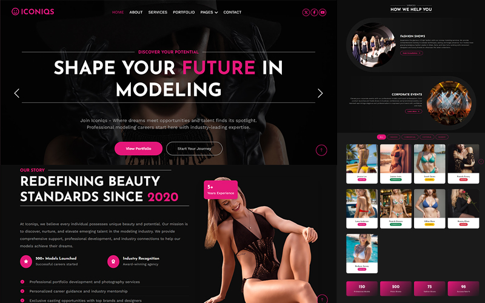

# 🌟 Iconiqs - Premium Modeling Agency Website

<div align="center">


*Screenshot of the Iconiqs Modeling Agency Website*

[]()
[]()
[]()
[]()
[]()

*Redefining Beauty Standards Since 2020*

[🌐 Live Demo](https://priyanshu84iya.github.io/Iconiqs/) · [📧 Contact](mailto:contact@iconiqs.com) · [📱 Instagram](https://instagram.com/pry_uchiha)

</div>

---

## 🎯 About Iconiqs

**Iconiqs** is a cutting-edge modeling agency website that represents the pinnacle of modern web design and user experience. We believe every individual possesses unique beauty and potential, and our digital platform reflects this philosophy through elegant design and seamless functionality.

### ✨ Key Features

- 🏆 **500+ Models Launched** - Successful careers started with us
- 🌍 **50+ Brand Partners** - Global reach and industry connections  
- 📈 **95% Success Rate** - Proven track record of excellence
- 🎨 **25 Fashion Weeks** - International fashion industry presence

---

## 🚀 Live Website

Experience the full website at: **[Your Domain Here]**

### 📱 Page Overview

| Page | Description | Status |
|------|-------------|--------|
| 🏠 **Home** | Modern hero sections, compelling CTAs, service highlights | ✅ Complete |
| 📖 **About** | Company story, mission & values, impact statistics | ✅ Complete |
| 🎨 **Portfolio** | Interactive filters, card-based gallery, statistics dashboard | ✅ Enhanced |
| 🔧 **Services** | Runway training, editorial shoots, career development | ⚡ Enhanced |
| 👥 **Team** | Model profiles, professional stats, social integration | ⚡ Enhanced |
| 📞 **Contact** | Interactive forms, location maps, multiple contact methods | ⚡ Enhanced |
| 💬 **Testimonials** | Client reviews, success stories, rating systems | ⚡ Enhanced |
| ❌ **404 Error** | Branded error page with helpful navigation | ⚡ Enhanced |

---

## 🛠️ Technology Stack

### Frontend Technologies
```
🌐 HTML5          - Semantic markup and structure
🎨 CSS3           - Modern styling and animations  
🚀 Bootstrap 5    - Responsive grid and components
⚡ JavaScript     - Interactive functionality
💫 jQuery         - DOM manipulation and effects
🎭 Font Awesome   - Professional icon library
```

### Libraries & Frameworks
```
📱 Bootstrap 5.0.0     - Responsive framework
🎨 Animate.css         - CSS animations
💡 WOW.js             - Scroll animations
🦉 Owl Carousel       - Image carousels
💫 Lightbox           - Image gallery
📈 Waypoints          - Scroll tracking
⚡ Easing             - Animation easing
```

### Design System
```
🎨 Primary Color:      #FF6B35 (Vibrant Orange)
🌙 Secondary Color:    #1A1A2E (Dark Navy)
📝 Typography:         Josefin Sans, Work Sans
📏 Grid System:        Bootstrap 12-column responsive
🎭 Icons:              Font Awesome 7.0.0
```

---

## 📂 Project Structure

```
Iconiqs/
│
├── 📄 index.html              # Homepage - Hero sections & CTAs
├── 📄 about.html              # About - Company story & values  
├── 📄 portfolio.html          # Portfolio - Model showcases
├── 📄 service.html            # Services - Agency offerings
├── 📄 team.html               # Team - Model profiles
├── 📄 contact.html            # Contact - Forms & information
├── 📄 testimonial.html        # Testimonials - Client reviews
├── 📄 404.html                # 404 - Error page
│
├── 📁 css/
│   ├── 🎨 bootstrap.min.css   # Bootstrap framework
│   └── 🎨 style.css           # Custom styles
│
├── 📁 js/
│   └── ⚡ main.js             # Custom JavaScript
│
├── 📁 img/                    # Image assets (28 files)
│   ├── 🖼️ carousel-1.jpg      # Hero image 1
│   ├── 🖼️ carousel-2.jpg      # Hero image 2
│   ├── 🖼️ about.png           # About section image
│   ├── 📸 portfolio-*.jpg     # Portfolio images (9)
│   ├── 👥 team-*.jpg          # Team member photos (8)
│   └── 🎯 service-*.jpg       # Service images (4)
│
├── 📁 lib/                    # External libraries
│   ├── 📁 animate/            # CSS animations
│   ├── 📁 bootstrap/          # Bootstrap source
│   ├── 📁 easing/             # Animation easing
│   ├── 📁 lightbox/           # Image lightbox
│   ├── 📁 owlcarousel/        # Carousel component
│   ├── 📁 waypoints/          # Scroll detection
│   └── 📁 wow/                # Scroll animations
│
└── 📁 scss/                   # SCSS source files
    └── 📁 bootstrap/          # Bootstrap SCSS
```

---

## 🎨 Design Highlights

### 🌟 Modern UI/UX Features
- **Responsive Design** - Perfect on all devices and screen sizes
- **Smooth Animations** - WOW.js scroll animations and CSS transitions
- **Professional Typography** - Carefully selected font combinations
- **Color Psychology** - Strategic use of colors for brand identity
- **Intuitive Navigation** - User-friendly menu and page structure

### 🔥 Interactive Elements
- **Hero Carousels** - Engaging image sliders with call-to-actions
- **Service Cards** - Modern card layouts with hover effects
- **Portfolio Gallery** - Lightbox image viewing experience  
- **Contact Forms** - Professional form design with validation
- **Social Integration** - Seamless social media connectivity

### 📱 Mobile-First Approach
- **Bootstrap Grid** - 12-column responsive layout system
- **Touch-Friendly** - Optimized for mobile interactions
- **Fast Loading** - Optimized images and efficient code
- **Cross-Browser** - Compatible with all modern browsers

---

## 🚀 Getting Started

### Quick Setup
```bash
# Clone the repository
git clone https://github.com/Priyanshu84iya/iconiqs-modeling-agency.git

# Navigate to project directory
cd iconiqs-modeling-agency

# Open in your preferred editor
code .

# Open index.html in your browser
start index.html
```

### 📋 Requirements
- Modern web browser (Chrome, Firefox, Safari, Edge)
- Text editor (VS Code, Sublime Text, Atom)
- Basic knowledge of HTML, CSS, and JavaScript

### 🔧 Customization
1. **Colors** - Update CSS variables in `css/style.css`
2. **Content** - Edit HTML files with your content
3. **Images** - Replace images in `img/` folder
4. **Contact Info** - Update contact details in relevant pages

---

## � Recent Updates - Portfolio Redesign

### ✨ Latest Features (v2.1)
- **🔥 Interactive Category Filtering** - Dynamic portfolio sorting by Fashion, Commercial, Editorial, and Runway
- **📱 Modern Card Layout** - Responsive card-based design with smooth hover animations
- **📊 Statistics Dashboard** - Real-time metrics showing 150+ models, 500+ shoots, 75+ fashion shows
- **⚡ Enhanced Performance** - Optimized CSS and JavaScript for faster loading
- **🎯 Better UX** - Improved mobile experience with touch-friendly interactions

### 🛠️ Technical Improvements
- **CSS Grid & Flexbox** - Modern layout systems for perfect responsive design
- **JavaScript Filtering** - Smooth category transitions with fade animations
- **Enhanced Lightbox** - Improved image viewing with detailed captions
- **Mobile Optimization** - Better performance on tablets and smartphones
- **SEO Enhancements** - Improved meta tags and structured data

---

## �🌟 Key Pages Overview

### 🏠 Homepage
- **Hero Section** - Compelling carousel with strong CTAs
- **About Preview** - Company introduction with statistics  
- **Services Overview** - Key service offerings with modern cards
- **Call-to-Action** - Newsletter signup and contact options

### 📖 About Page  
- **Company Story** - Professional narrative and achievements
- **Mission & Values** - Core principles with visual icons
- **Impact Statistics** - Quantified success metrics
- **Team Preview** - Introduction to key personnel

### 🎨 Portfolio Page
- **Interactive Category Filters** - Fashion, Commercial, Editorial, Runway
- **Modern Card Design** - Responsive grid with hover animations  
- **Enhanced Lightbox** - Professional image viewing experience
- **Statistics Dashboard** - Live metrics and achievements counter
- **Mobile Optimized** - Touch-friendly interface for all devices

### 🔧 Services Page
- **Service Cards** - Detailed offering descriptions
- **Pricing Tables** - Transparent pricing structure  
- **Booking System** - Easy consultation scheduling
- **Process Overview** - Step-by-step service delivery

---

## 📊 Performance & SEO

### ⚡ Optimization Features
- **Compressed Images** - Optimized for fast loading
- **Minified CSS/JS** - Reduced file sizes
- **Semantic HTML** - SEO-friendly structure
- **Meta Tags** - Proper page descriptions and keywords
- **Mobile Responsive** - Mobile-first design approach

### 📈 Analytics Ready
- Google Analytics integration ready
- Social media pixel support
- Conversion tracking capabilities
- Performance monitoring setup

---

## 🤝 Contributing

We welcome contributions to improve the Iconiqs website! Here's how you can help:

### 🐛 Bug Reports
- Use GitHub Issues to report bugs
- Include screenshots and browser information
- Describe steps to reproduce the issue

### ✨ Feature Requests  
- Suggest new features via GitHub Issues
- Explain the use case and benefits
- Provide mockups or examples if possible

### 🔧 Development Setup
```bash
# Fork the repository
# Create a feature branch
git checkout -b feature/amazing-feature

# Make your changes
# Commit your changes
git commit -m 'Add some amazing feature'

# Push to the branch
git push origin feature/amazing-feature

# Open a Pull Request
```

---

## 📄 License

This project is licensed under the MIT License - see the [LICENSE.txt](LICENSE.txt) file for details.

---

## 👨‍💻 Developer

<div align="center">

### **Priyanshu Chaurasiya**
*Full-Stack Developer & Designer*

[](https://github.com/Priyanshu84iya)
[](https://instagram.com/pry_uchiha)
[](https://linkedin.com/in/priyanshu-chaurasiya)

*"Creating digital experiences that inspire and empower"*

</div>

---

## 🎯 Future Enhancements

### 🔮 Planned Features
- [x] **Portfolio Redesign** - ✅ Completed with interactive filters and modern cards  
- [ ] **Model Portal** - Dedicated login system for models
- [ ] **Booking System** - Online appointment scheduling
- [ ] **Blog Section** - Industry insights and updates
- [ ] **Multi-language** - International accessibility
- [ ] **Payment Integration** - Online payment processing
- [ ] **Live Chat** - Real-time customer support
- [ ] **Social Feed** - Instagram integration
- [ ] **Virtual Casting** - Video call capabilities

### 🚀 Technical Roadmap
- [ ] **React Migration** - Modern framework implementation
- [ ] **CMS Integration** - Content management system
- [ ] **API Development** - Backend services
- [ ] **PWA Features** - Progressive web app capabilities
- [ ] **Performance Optimization** - Speed improvements
- [ ] **Accessibility** - WCAG compliance
- [ ] **Analytics Dashboard** - Business intelligence tools

---

## 📞 Support & Contact

### 💬 Get Help
- **Email**: [contact@iconiqs.com](mailto:contact@iconiqs.com)
- **GitHub Issues**: [Report a problem](https://github.com/Priyanshu84iya/iconiqs-modeling-agency/issues)
- **Instagram**: [@pry_uchiha](https://instagram.com/pry_uchiha)

### 🏢 Business Inquiries
- **Modeling Applications**: Apply through our contact form
- **Brand Partnerships**: Email for collaboration opportunities
- **Media Requests**: Press inquiries welcome

---

<div align="center">

### 🌟 Thank you for visiting Iconiqs! 🌟

*Made with ❤️ by [Priyanshu Chaurasiya](https://github.com/Priyanshu84iya)*

**⭐ Star this repository if you find it helpful!**

---

*© 2025 Iconiqs Modeling Agency. All rights reserved.*

</div>